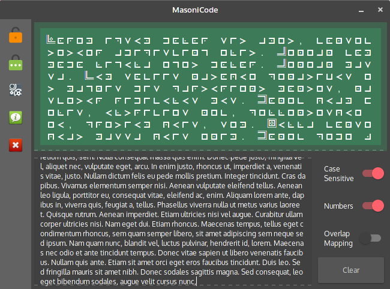

# MasoniCode
   


## What is masonic code?
Masonic code is also called "Pigpen cipher".   
"The pigpen cipher (alternately referred to as the masonic cipher, Freemason's cipher, Napoleon cipher, and tic-tac-toe cipher is a geometric simple substitution cipher, which exchanges letters for symbols which are fragments of a grid. The example key shows one way the letters can be assigned to the grid." ———— [From wikipedia](https://en.wikipedia.org/wiki/Pigpen_cipher "From Wikipedia")   

## The Rules
   
### There are two style of masonic code:   
One is standard (require 2 sharp signs & 2 cross signs, work separately)   
Another one is pair overlap mapping (AB-CD-EF pairly map to a area, require 1 sharp sign and 1 cross sign only)   

## Dependencies   
| Packages              | Version                          |
| --------------------- | -------------------------------- |
| Lua5.1                | \>= 5.1.x                        |
| LuaJIT                | \>= 2.0.x                        |
| lua-lgi               | Included in project file `./lgi` |
| lua-ffi               | Included in LuaJIT               |
| GObject Introspection | \>= 1.56.1-1                     |


### Ubuntu 18.04

```bash
sudo apt install lua5.1 luajit libgirepository1.0-dev
```


## How to use ?
#### Running Masonicode
```bash
unzip MasoniCode-master.zip
cd ./MasoniCode-master
chmod +x ./main.lua
./main.lua
```

#### Shortcut
<kbd> Ctrl </kbd> + <kbd> p </kbd> :  Hide side toolbar   
<kbd> Ctrl </kbd> + <kbd> t </kbd> :  Switch theme   
<kbd> Ctrl </kbd> + <kbd> 1 </kbd> :  Decoder mode   
<kbd> Ctrl </kbd> + <kbd> 2 </kbd> :  Encoder mode    
<kbd> Ctrl </kbd> + <kbd> k </kbd> :  Hide virtual keyboard in Decoder mode    


#### Dark/Light theme support

#### Decoder mode
- [x] Interactive interpreting
- [x] Virtual Keyboard
- [x] Case-sensitive mode 
- [x] Numbers support
- [x] Overlap mapping mode
- [x] Clear all   

#### Encoder mode
- [x] Interactive interpreting
- [x] Case-sensitive mode 
- [x] Numbers support
- [x] Overlap mapping mode
- [x] Clear all
